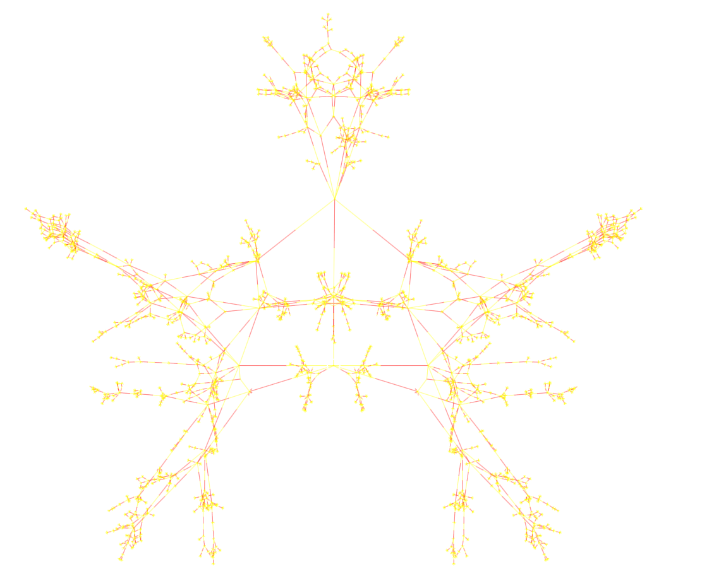

# WeakC4-Webpage
Stable version of the Connect 4 graph viewer site. Desktop only, may be laggy even with a beefy system.
The graph was generated using SwapTube, specifically the `BuildGraph` project.
 
See the graph [here](https://2swap.github.io/WeakC4/), and some explanation [here](https://2swap.github.io/WeakC4/explanation). 

Steady-state diagrams that shrink the graph are welcome; see [CONTRIBUTING.md](CONTRIBUTING.md). New diagrams are exhaustively verified automatically, and the representations are rebuilt from `solution/steady_states.json` and `solution/branches.json` after merge.
